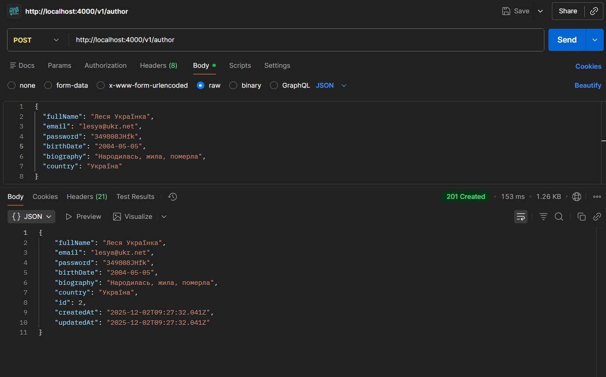
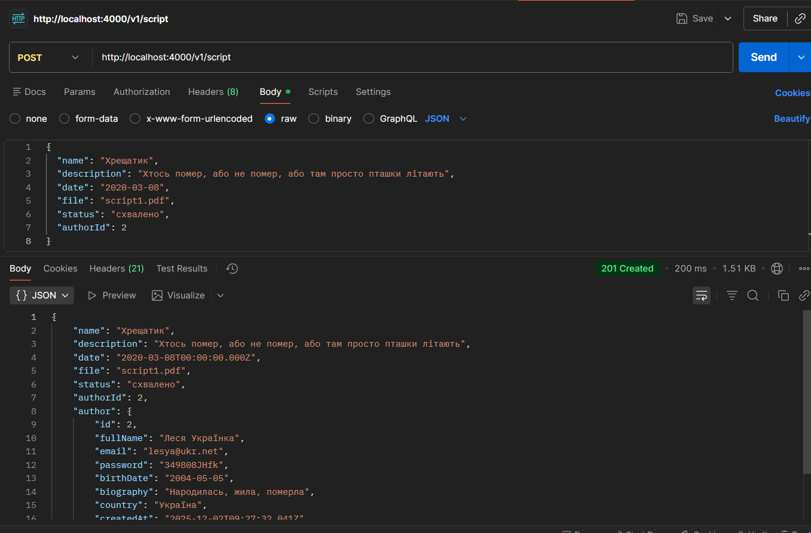
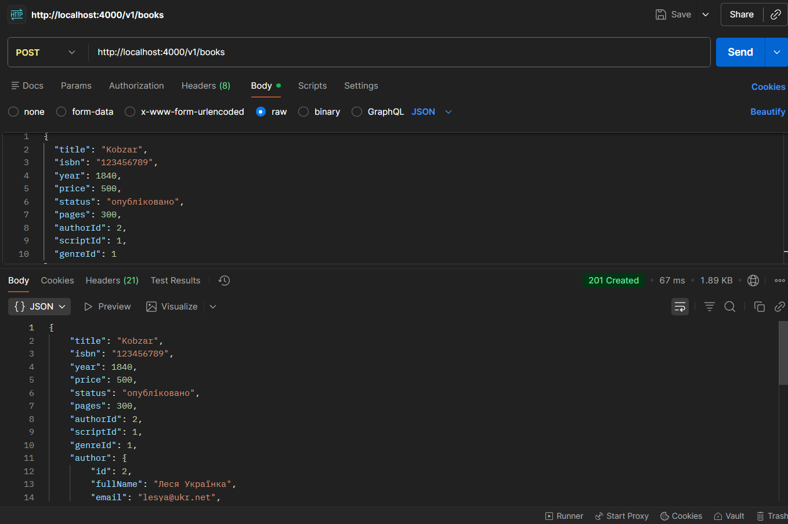
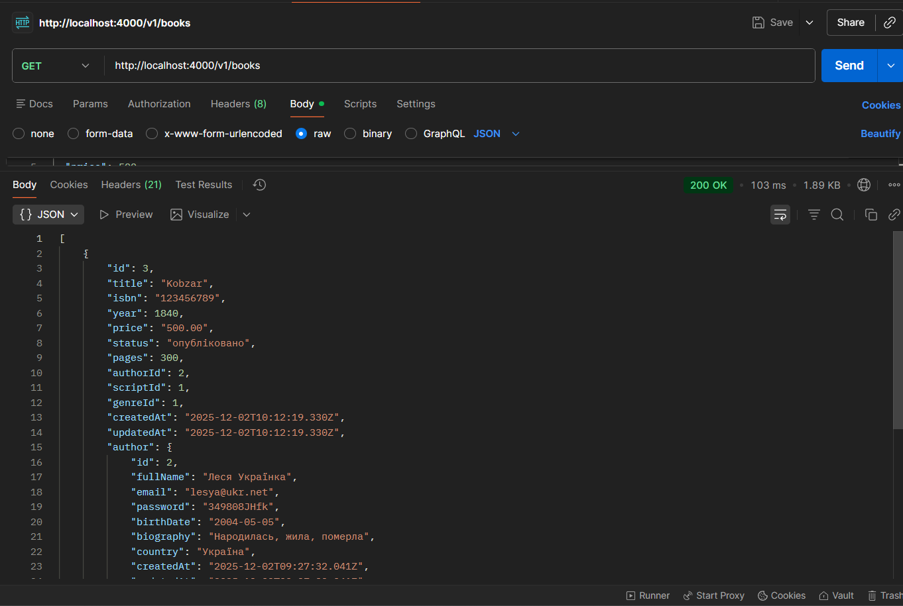
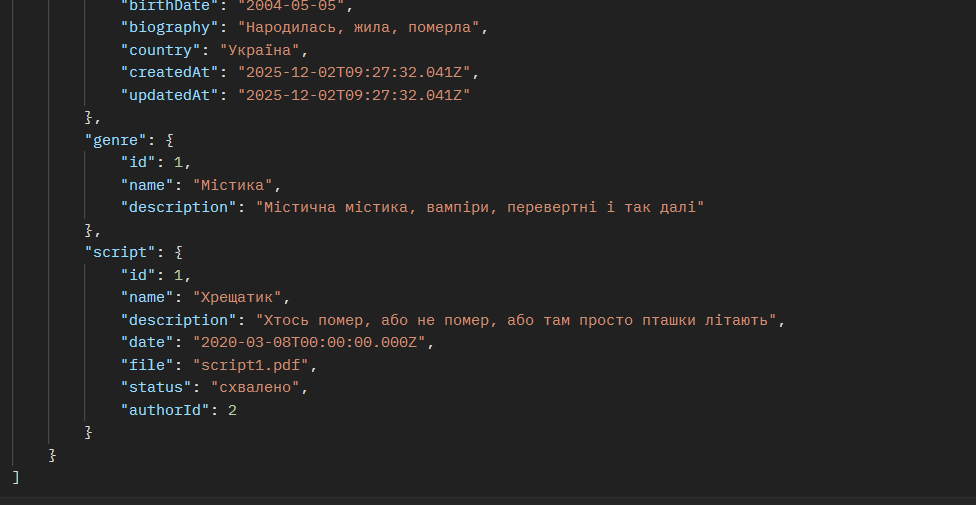
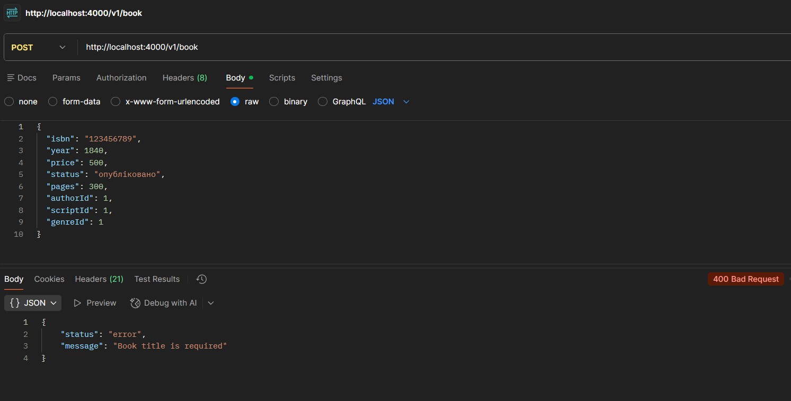
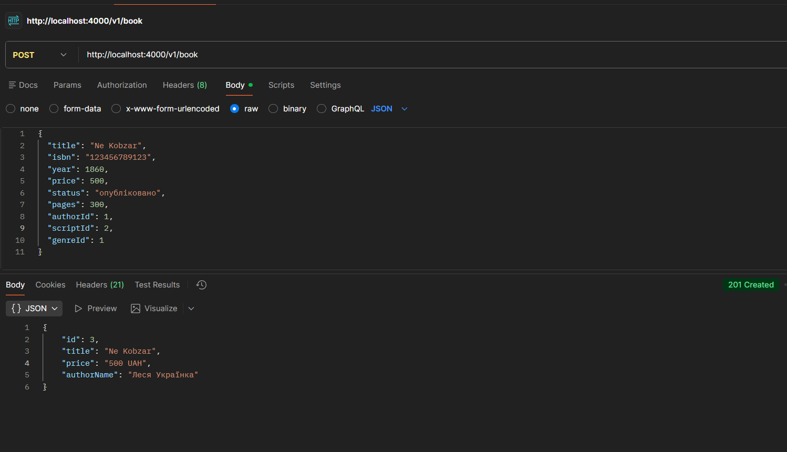

# Лабораторна робота №5: Розширення бекенду власними сутностями

У цій роботі реалізовано повноцінний REST API для роботи з базою даних видавництва. Створено сутності, налаштовано міграції та реалізовано зв'язки між таблицями.

## Реалізовані сутності

Було створено 4 основні сутності згідно з варіантом курсової роботи:

1.  **Author** (Автори) - містить інформацію про авторів.
2.  **Book** (Книги) - основна сутність, пов'язана з іншими.
3.  **Genre** (Жанри) - категорії книг.
4.  **Script** (Рукописи) - вихідні матеріали для книг.

## Реалізовані зв'язки

* **One-to-Many:** Один `Author` може мати багато `Books`.
* **One-to-Many:** Один `Genre` може мати багато `Books`.
* **One-to-One:** Одна `Book` створена на основі одного `Script`.

## API Ендпоінти

| Метод | URL | Опис |
| :--- | :--- | :--- |
| **POST** | `/v1/author` | Створити нового автора |
| **POST** | `/v1/books` | Створити книгу (з прив'язкою до автора, жанру, рукопису) |
| **GET** | `/v1/books` | Отримати всі книги (JOIN з автором, жанром та рукописом) |
| **POST** | `/v1/genre` | Створити жанр |
| **POST** | `/v1/script` | Створити рукопис |

## Демонстрація роботи (Postman)

### 1. Створення Автора, Жанру та Рукопису



### 2. Створення Книги

### 3. Перевірка зв'язків (GET Books)
На скріншоті видно, що при запиті книг сервер повертає вкладені об'єкти автора (`author`), жанру (`genre`) та рукопису (`script`) що підтверджує роботу JOIN.



# Архітектура Backend-додатку

У цьому проєкті реалізовано пошарову архітектуру (Layered Architecture), що забезпечує чіткий розподіл відповідальності та легку підтримку коду.

## Опис шарів

1.  **Middleware (Валідація):**
    Цей шар відповідає за перевірку вхідних даних перед тим, як вони потраплять до контролера. Якщо дані некоректні (наприклад, неправильний email або короткий пароль), middleware перериває запит і повертає помилку 400.

2.  **Controller (Оркестрація):**
    Контролери приймають HTTP-запити від клієнта, викликають відповідні сервіси для обробки даних і повертають сформовану відповідь (зазвичай у вигляді JSON з використанням DTO).

3.  **Service (Бізнес-логіка):**
    Серце додатку. Тут відбувається вся основна робота: обробка даних, складні обчислення та виклики репозиторіїв. Сервіси не знають про HTTP, вони працюють тільки з даними.

4.  **Repository (Доступ до даних):**
    Шар, що відповідає за пряму взаємодію з базою даних (ORM TypeORM). Виконує запити на створення, читання, оновлення та видалення записів (CRUD).

## Приклади коду

### Middleware (Валідація)
```typescript
import { Request, Response, NextFunction } from 'express';
import validator from 'validator';
import { AppError } from '../../../errors/AppError';

export async function validatorCreateBook(req: Request, _res: Response, next: NextFunction) {
  const { title, price, isbn } = req.body;

  if (!title || validator.isEmpty(title)) {
    return next(new AppError(400, 'Book title is required'));
  }

  if (price === undefined || price === null) {
     return next(new AppError(400, 'Price is required'));
  }

  if (!validator.isFloat(String(price), { gt: 0 })) {
    return next(new AppError(400, 'Price must be a number greater than 0'));
  }

  if (!isbn || !validator.isLength(isbn, { min: 10, max: 13 })) {
     return next(new AppError(400, 'ISBN must be between 10 and 13 characters'));
  }

  return next();
}
```
### ResponseDTO
```typescript
import { Request, Response, NextFunction } from "express";
import { BookService } from "../../services/BookService";
import { BookResponseDTO } from "../../dto/BookResponseDTO";

export class BookController {
  private service = new BookService();

  async create(req: Request, res: Response, next: NextFunction) {
    try {
      const result = await this.service.create(req.body);
      res.status(201).json(new BookResponseDTO(result)); 
    } catch (error) {
      next(error);
    }
  }

  async getAll(req: Request, res: Response, next: NextFunction) {
    try {
      const results = await this.service.findAll();
      const dtos = results.map(book => new BookResponseDTO(book));
      res.status(200).json(dtos);
    } catch (error) {
      next(error);
    }
  }
}
```
### Service
```typescript
import { getRepository } from "typeorm";
import { Book } from "../orm/entities/users/Book";  
import { Author } from "../orm/entities/users/Author";
import { Genre } from "../orm/entities/users/Genre"
import { Script } from "../orm/entities/users/Script";

export class BookService {
  async create(data: any) {
    const bookRepo = getRepository(Book);
    const authorRepo = getRepository(Author);
    const genreRepo = getRepository(Genre);
    const scriptRepo = getRepository(Script);

    const author = await authorRepo.findOne({ where: { id: data.authorId } });
    if (!author) {
      throw new Error("Author not found");
    }

    let genre = null;
    if (data.genreId) {
      genre = await genreRepo.findOne({ where: { id: data.genreId } });
      if (!genre) console.log("Genre not found, creating book without genre");
    }

    let script = null;
    if (data.scriptId) {
      script = await scriptRepo.findOne({ where: { id: data.scriptId } });
      if (!script) console.log("Script not found, creating book without script");
    }

    const book = bookRepo.create({
      title: data.title,
      isbn: data.isbn,
      year: data.year,
      price: data.price,
      status: data.status || 'опубліковано',
      pages: data.pages,
      author: author, 
      genre: genre,
      script: script,
      authorId: author.id,
      genreId: genre.id,
      scriptId: script.id
    });

    return await bookRepo.save(book);
  }

  async findAll() {
    const bookRepo = getRepository(Book);
    return await bookRepo.find({
      relations: ['author', 'genre', 'script'] 
    });
  }
}
```
## Скріншоти
1. Скріншот помилкового запиту

2. Скріншот успішного створення книги

